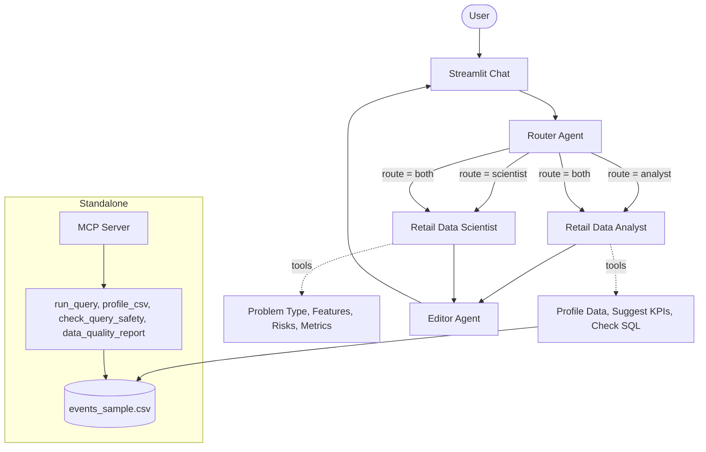

# Architecture

Router, analyst, scientist, and editor each run as their own single-task
`Process.sequential` crew, called one after another by `app.py`. This is
different from CrewAI's `Process.hierarchical`, where a manager agent
delegates automatically at runtime. Here the app decides the path up front
based on the router's one-line output, which makes the flow easier to trace
and log in the sidebar.

The MCP server is a separate process (`python mcp_server/server.py`) with
its own read-only DuckDB tools. It is not wired into the Streamlit process
in this version, it can be started and queried independently, which is a
gap worth closing in a later revision.
